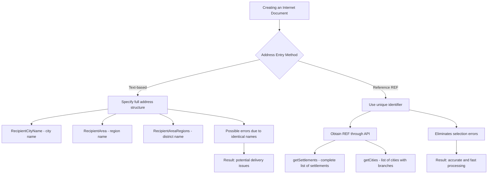

# Address Handling Logic When Creating Internet Documents (ID)

When creating an Internet Document (ID) through the API, there are several ways to input the recipient's address, each with its own characteristics. Incorrect address entry complicates delivery, requires additional efforts to correct, and affects delivery times.

## Methods of Entering Recipient's Address



## Entering Addresses Using Text Names

If you specify an address with text, it's important to provide the complete address structure. For text-based address entry, you must specify the following fields:

- **RecipientCityName** (recipient's city name)
- **RecipientArea** (region name)
- **RecipientAreaRegions** (district name)

This is necessary to avoid confusion with identical city names that may be located in different regions or districts.

### Examples of When This Is Important

- The settlement "Kamianske" exists in Zaporizhzhia, Zakarpattia, Lviv, and Dnipropetrovsk regions. In the Dnipropetrovsk region, there are actually two Kamianskes: one in the Kamianske district and another in the Nikopol district.
- Ivanivka is the most common place name in Ukraine, so the same settlement name can be found in different districts of the same region.

To avoid delivery errors in such cases, it is necessary to provide complete information about the location of the settlement.

## Entering Addresses Using References (REF)

REF is a unique internal identifier used in the Nova Poshta system to identify settlements. It is provided through the API during requests to obtain available cities or settlements where deliveries are made.

If you use a unique city identifier (REF) when specifying the recipient's address, there is no need to specify the complete address structure (region, district). This simplifies the input process and eliminates the possibility of errors when selecting the correct settlement.

## Obtaining REF Through API

To obtain the REF of a settlement, use the following API methods:

### Settlements Directory (getSettlements method)

Returns a list of all settlements to which Nova Poshta delivers.

**It is recommended to use this method specifically**, as it contains the largest number of settlements for address delivery.

### Cities Directory (getCities method)

This directory is loaded only with settlements where there are Nova Poshta branches. This method can also be used, but it contains fewer settlements compared to the settlements directory.

## Example Request for Obtaining REF

```json
{
  "apiKey": "your_api_key",
  "modelName": "Address",
  "calledMethod": "getSettlements",
  "methodProperties": {
    "FindByString": "Kyiv",
    "Limit": 20
  }
}
```

## Recommendations

When working with addresses in the API for creating an ID, it's important to understand that:

1. **Text-based address entry** requires complete detailing to avoid confusion between cities with identical names.
   
2. **Using REF** simplifies the process and eliminates the possibility of errors.

3. For more accurate and faster work with addresses, it is recommended to use the **getSettlements** method, as this directory covers a wider range of settlements.

4. Store the obtained REFs in your system for future use and update them periodically.
