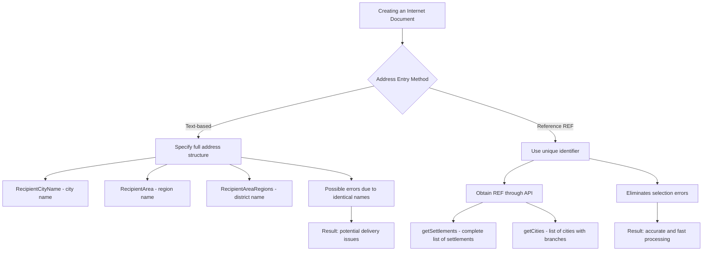

# Address Handling Logic When Creating Internet Documents (ID)

## What is an Internet Document (ID)?

An Internet Document (ID or "ІД" in Ukrainian) is a document containing information about a client's shipment that can be created through a personal account, API, 1C module, or mobile app without Nova Poshta staff involvement. The ID can be used for actual shipment if printed and handed to Nova Poshta employees along with the cargo.

An Internet Document is primarily a document that clients create, edit, and print themselves. Until the ID is handed to a Nova Poshta employee, neither the client nor the employees make an actual shipment. Note that if an ID is created with pick-up from an address (when a client wants someone to come and collect the cargo), such IDs are processed by Nova Poshta staff who may contact the client to clarify information about the address or other cargo details.

## What is an Express Invoice (EI)?

An Express Invoice (EI or "ЕН" in Ukrainian) is a document containing information about a client's cargo, which is used for the actual shipment and tracking of cargo. EIs are created by Nova Poshta employees. Using the API, clients can modify data in an EI, but separate methods unrelated to IDs are created for this purpose.

IDs and EIs can be linked. This happens when a client first creates an ID for a shipment and then hands it to a Nova Poshta employee along with the cargo. In this scenario, the ID data is used as a basis, and an EI document is created based on it, which is then used for the actual shipment of cargo.

## Methods of Entering Recipient's Address



## Entering Addresses Using Text Names

If you specify an address with text, it's important to provide the complete address structure. For text-based address entry, you must specify the following fields:

- **RecipientCityName** (recipient's city name)
- **RecipientArea** (region name)
- **RecipientAreaRegions** (district name)

This is necessary to avoid confusion with identical city names that may be located in different regions or districts.

### Examples of When This Is Important

- The settlement "Kamianske" exists in Zaporizhzhia, Zakarpattia, Lviv, and Dnipropetrovsk regions. In the Dnipropetrovsk region, there are actually two Kamianskes: one in the Kamianske district and another in the Nikopol district.
- Ivanivka is the most common place name in Ukraine, so the same settlement name can be found in different districts of the same region.

To avoid delivery errors in such cases, it is necessary to provide complete information about the location of the settlement.

## Entering Addresses Using References (REF)

REF is a unique internal identifier used in the Nova Poshta system to identify settlements. It is provided through the API during requests to obtain available cities or settlements where deliveries are made.

If you use a unique city identifier (REF) when specifying the recipient's address, there is no need to specify the complete address structure (region, district). This simplifies the input process and eliminates the possibility of errors when selecting the correct settlement.

## Obtaining REF Through API

To obtain the REF of a settlement, use the following API methods:

### Settlements Directory (getSettlements method)

Returns a list of all settlements to which Nova Poshta delivers.

**It is recommended to use this method specifically**, as it contains the largest number of settlements for address delivery.

### Cities Directory (getCities method)

This directory is loaded only with settlements where there are Nova Poshta branches. This method can also be used, but it contains fewer settlements compared to the settlements directory.

## Example Request for Obtaining REF

```json
{
  "apiKey": "your_api_key",
  "modelName": "Address",
  "calledMethod": "getSettlements",
  "methodProperties": {
    "FindByString": "Kyiv",
    "Limit": 20
  }
}
```

## Key API Methods for Working with Nova Poshta

### 1. Creating an Express Invoice (Internet Document)

Method `save` in the `InternetDocument` model allows creating/forming an express invoice (internet document).

If delivery type "CargoType": "Documents" is selected, the following weight parameters are available: 0.1 or 0.5 or 1. All other cases will return an error.

This request can include a return delivery specification. For more details on various return delivery options, see the "Create an EI with return delivery" section.

It's possible to create an express invoice with payment from a "Third Person" by replacing the `PayerType` parameter with:

```json
"PayerType": "ThirdPerson",
"ThirdPerson": "5953fb16-08d8-11e4-8958-0025909b4e33"
```

For the ThirdPerson payer, the payment form can only be "Non-cash payment."

After creating an internet document in the API environment, the EI appears in the list of EIs in the personal account.

Example request:

```json
{
   "apiKey": "[YOUR KEY]",
   "modelName": "InternetDocumentGeneral",
   "calledMethod": "save",
   "methodProperties": {
      "SenderWarehouseIndex": "101/102",
      "RecipientWarehouseIndex": "101/102",
      "PayerType": "Sender",
      "PaymentMethod": "Cash",
      "DateTime": "dd.mm.yyyy",
      "CargoType": "Cargo",
      "VolumeGeneral": "0.45",
      "Weight": "0.5",
      "ServiceType": "DoorsWarehouse",
      "SeatsAmount": "2",
      "Description": "Additional shipment description",
      "Cost": "15000",
      "CitySender": "00000000-0000-0000-0000-000000000000",
      "Sender": "00000000-0000-0000-0000-000000000000",
      "SenderAddress": "00000000-0000-0000-0000-000000000000",
      "ContactSender": "00000000-0000-0000-0000-000000000000",
      "SendersPhone": "380660000000",
      "CityRecipient": "00000000-0000-0000-0000-000000000000",
      "Recipient": "00000000-0000-0000-0000-000000000000",
      "RecipientAddress": "00000000-0000-0000-0000-000000000000",
      "ContactRecipient": "00000000-0000-0000-0000-000000000000",
      "RecipientsPhone": "380660000000"
   }
}
```

### 2. Online Search in Settlements Directory

Method `searchSettlements` in the `Address` model is necessary for ONLINE SEARCH of settlements.

Thanks to this method, there's no need to store directories on your side and update them.

Example request:

```json
{
   "apiKey": "[YOUR KEY]",
   "modelName": "AddressGeneral",
   "calledMethod": "searchSettlements",
   "methodProperties": {
      "CityName": "київ",
      "Limit": "50",
      "Page": "2"
   }
}
```

### 3. Online Search for Streets in Settlements Directory

Method `searchSettlementStreets` in the `Address` model is necessary for ONLINE SEARCH of streets in a selected settlement.

Thanks to this method, there's no need to store directories on your side and update them.

Example request:

```json
{
   "apiKey": "[YOUR KEY]",
   "modelName": "AddressGeneral",
   "calledMethod": "searchSettlementStreets",
   "methodProperties": {
      "StreetName": "Хрещатик",
      "SettlementRef": "00000000-0000-0000-0000-000000000000",
      "Limit": "50"
   }
}
```

### 4. Loading Counterparty Addresses

Method `getCounterpartyAddresses` in the `Counterparty` model loads a list of sender/recipient counterparty addresses.

It's necessary to store a copy of the directory on the client side and keep it up to date.

It's recommended to update directories once a month.

Example request:

```json
{
   "apiKey": "[YOUR KEY]",
   "modelName": "CounterpartyGeneral",
   "calledMethod": "getCounterpartyAddresses",
   "methodProperties": {
      "Ref": "00000000-0000-0000-0000-000000000000",
      "CounterpartyProperty": "Sender"
   }
}
```

### 5. Loading Counterparty Contact Persons

Method `getCounterpartyContactPersons` in the `Counterparty` model loads a list of counterparty contact persons.

If the method contains more than 100 counterparty contact persons, use the `Page` parameter.

Example: `"methodProperties": { "Page": "22" }`

It's necessary to store a copy of the directory on the client side and keep it up to date.

It's recommended to update directories once a day.

Example request:

```json
{
   "apiKey": "[YOUR KEY]",
   "modelName": "CounterpartyGeneral",
   "calledMethod": "getCounterpartyContactPersons",
   "methodProperties": {
      "Ref": "00000000-0000-0000-0000-000000000000",
      "Page": "1"
   }
}
```

### 6. Loading Counterparties List (Senders/Recipients/Third Parties)

Method `getCounterparties` in the `Counterparty` model loads a list of counterparties (senders, recipients, and third parties).

If the method contains more than 100 counterparties, use the `Page` parameter for pagination.

You can use the `FindByString` parameter to search for specific counterparties by name.

Example: 
```json
"methodProperties": {
  "FindByString": "Талісман",
  "Page": "1"
}
```

It's necessary to store a copy of the directory on the client side and keep it up to date.

It's recommended to update directories once a day.

Example request:

```json
{
   "apiKey": "[YOUR KEY]",
   "modelName": "CounterpartyGeneral",
   "calledMethod": "getCounterparties",
   "methodProperties": {
      "CounterpartyProperty": "Sender",
      "Page": "1"
   }
}
```

Example response:

```json
{
    "success": true,
    "data": [{
      "Description": "Талісман ТОВ",
      "Ref": "00000000-0000-0000-0000-000000000000",
      "City": "00000000-0000-0000-0000-000000000000",
      "Counterparty": "null",
      "FirstName": "Іван",
      "LastName": "Іванов",
      "MiddleName": "Іванович",
      "OwnershipFormRef": "00000000-0000-0000-0000-000000000000",
      "OwnershipFormDescription": "ТОВ",
      "EDRPOU": "37193071",
      "CounterpartyType": "Organization"
    }],
    "errors": [],
    "warnings": [],
    "info": [],
    "messageCodes": [],
    "errorCodes": [],
    "warningCodes": [],
    "infoCodes": []
}
```

**Request parameters:**

| Parameter | Type | Description |
|-----------|------|-------------|
| CounterpartyProperty* | string[36] | Counterparty type: Sender/Recipient/ThirdPerson |
| Page | string[36] | Page with information to display (max 100 records per page) |

\* Required parameter

**Response parameters:**

| Parameter | Type | Description |
|-----------|------|-------------|
| Description | string[50] | Description in Ukrainian |
| Ref | string[36] | Identifier |
| City | string[36] | Counterparty city |
| Counterparty | string[36] | Counterparty |
| FirstName | string[36] | First name |
| LastName | string[36] | Last name |
| MiddleName | string[36] | Patronymic |
| OwnershipFormRef | string[36] | Ownership form identifier |
| OwnershipFormDescription | string[36] | Ownership form description |
| EDRPOU | string[36] | EDRPOU code |
| CounterpartyType | string[36] | Counterparty type |

### 7. Creating a Counterparty

Method `save` in the `Counterparty` model is used to create a recipient counterparty.

This method allows creating recipient counterparties with the type "Private Person".

Recipient data must be entered in Ukrainian language only.

It's recommended to update the directory once a month.

Example request (JSON):

```json
{
   "apiKey": "[YOUR KEY]",
   "modelName": "CounterpartyGeneral",
   "calledMethod": "save",
   "methodProperties": {
      "FirstName": "Іван",
      "MiddleName": "Іванович",
      "LastName": "Іванов",
      "Phone": "380997979789",
      "Email": "test@i.com",
      "CounterpartyType": "PrivatePerson",
      "CounterpartyProperty": "Recipient"
   }
}
```

Example request (XML):

```xml
<?xml version="1.0" encoding="UTF-8"?>
<file>
    <apiKey>[YOUR KEY]</apiKey>
    <modelName>CounterpartyGeneral</modelName>
    <calledMethod>save</calledMethod>
    <methodProperties>
        <FirstName>Іван</FirstName>
        <MiddleName>Іванович</MiddleName>
        <LastName>Іванов</LastName>
        <Phone>380997979789</Phone>
        <Email>test@i.com</Email>
        <CounterpartyType>PrivatePerson</CounterpartyType>
        <CounterpartyProperty>Recipient</CounterpartyProperty>
    </methodProperties>
</file>
```

The API always returns code 200, even in case of logical errors.

Example response:

```json
{
    "success": true,
    "data": [{
        "Ref": "00000000-0000-0000-0000-000000000000",
        "Description": "Іванов Іван Іванович",
        "FirstName": "Іван",
        "MiddleName": "Іванович",
        "LastName": "Іванов",
        "Counterparty": "00000000-0000-0000-0000-000000000000",
        "OwnershipForm": "00000000-0000-0000-0000-000000000001",
        "OwnershipFormDescription": "Null",
        "EDRPOU": "Null",
        "CounterpartyType": "PrivatePerson",
        "ContactPerson": [
            {
                "success": true,
                "data": [
                    {
                        "Ref": "c80e9610-e98b-11ef-b619-005056bdc0e9",
                        "Description": "Іванов Іван Іванович",
                        "LastName": "Іванов",
                        "FirstName": "Іван",
                        "MiddleName": "Іванович"
                    }
                ],
                "errors": [],
                "translatedErrors": [],
                "warnings": [],
                "info": [],
                "messageCodes": [],
                "errorCodes": [],
                "warningCodes": [],
                "infoCodes": []
            }
        ]
    }],
    "errors": [],
    "warnings": [],
    "info": [],
    "messageCodes": [],
    "errorCodes": [],
    "warningCodes": [],
    "infoCodes": []
}
```

**Request parameters:**

| Parameter | Type | Description |
|-----------|------|-------------|
| FirstName* | string[36] | First name of the contact person |
| MiddleName* | string[36] | Patronymic of the contact person |
| LastName* | string[36] | Last name of the contact person |
| Phone* | string[36] | Phone number of the contact person |
| Email | string[36] | Email of the contact person |
| CounterpartyType* | string[36] | Counterparty type |
| CounterpartyProperty* | string[36] | Counterparty properties |

\* Required parameter

**Response parameters:**

| Parameter | Type | Description |
|-----------|------|-------------|
| Ref | string[36] | Identifier (REF) of the contact person |
| Description | string[50] | Counterparty description in Ukrainian |
| FirstName | string[36] | First name |
| MiddleName | string[36] | Patronymic |
| LastName | string[36] | Last name |
| Counterparty | string[36] | Counterparty identifier |
| OwnershipForm | string[36] | Ownership form identifier |
| OwnershipFormDescription | string[36] | Ownership form description |
| EDRPOU | string[36] | EDRPOU code |
| CounterpartyType | string[36] | Counterparty type |
| ContactPerson | array | Contact person information |

## Recommendations

When working with addresses in the API for creating an ID, it's important to understand that:

1. **Text-based address entry** requires complete detailing to avoid confusion between cities with identical names.
   
2. **Using REF** simplifies the process and eliminates the possibility of errors.

3. For more accurate and faster work with addresses, it is recommended to use the **getSettlements** method, as this directory covers a wider range of settlements.

4. Store the obtained REFs in your system for future use and update them periodically.
